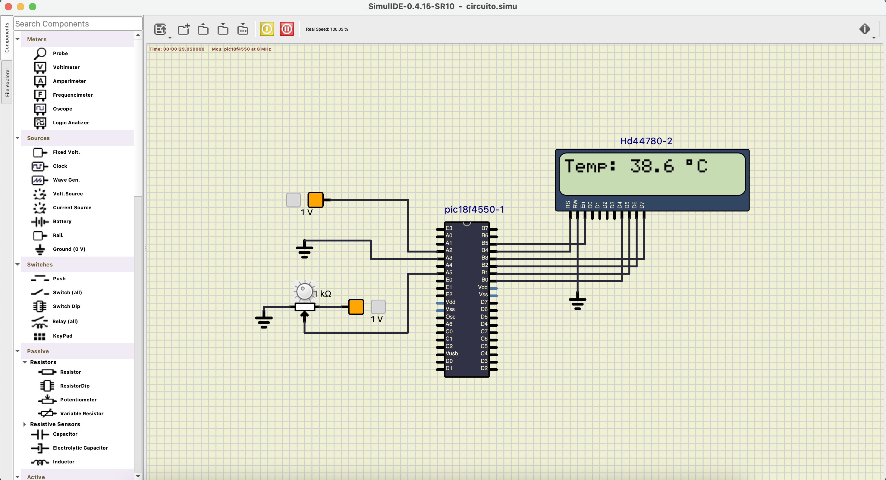
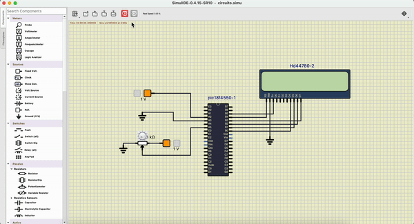

# Projeto 3 - Simulação de Sensor de Temperatura com PIC18F4550 e Display LCD

## Disciplina: SEL0614 - Aplicação de Microprocessadores 
### Parte 2 - Microcontroladores PIC e Programação em Linguagem C

## Membros do Grupo

- Leonardo Gueno Rissetto (13676482)
- Thiago Kashivagui Gonçalves (13676579)
- Lucas Lima Romero (13676325)
- Marco Antonio Gaspar Garcia (11833581)

## 1. Resumo
Este projeto simula a leitura de temperatura de um sensor LM35 utilizando o microcontrolador PIC18F4550. Como o SimulIDE não possui um sensor LM35, um potenciômetro é utilizado para simular a variação de temperatura, enquanto a tensão lida é exibida como uma temperatura de 0 a 100°C em um display LCD. A configuração do conversor A/D (ADC) foi ajustada para utilizar referências de tensão externa (Vref) de 0 a 1V, adequando-se à sensibilidade do LM35.

## 2. Objetivos
O objetivo deste projeto é simular a leitura de um sensor de temperatura LM35, exibindo a temperatura no display LCD. A simulação inclui a configuração de referências de tensão externas no ADC do PIC18F4550 e o uso de um potenciômetro para representar a variação de temperatura de 0 a 100°C.

### Específicos:
- Simular a leitura de um sensor LM35 com um potenciômetro variando de 0 a 1V.
- Exibir a temperatura de 0 a 100°C em um display LCD.
- Configurar o ADC do PIC18F4550 com referências de tensão externas para adequar a leitura à sensibilidade do LM35.

## 3. Materiais e Métodos
### Materiais:
- **Microcontrolador**: PIC18F4550.
- **Kit de desenvolvimento**: EasyPIC v7.
- **Simulador**: SimulIDE.
- **Linguagem de programação**: C.
- **Componentes adicionais**: Potenciômetro para simular variação de temperatura e Display LCD 16x2.

### Métodos:
O projeto foi desenvolvido em MikroC PRO for PIC e testado no SimulIDE. O potenciômetro é utilizado para simular a variação de temperatura de um sensor LM35, e o display LCD mostra a leitura correspondente. A variação de tensão no potenciômetro, de 0 a 1V, é lida pelo ADC, convertido em uma temperatura entre 0 e 100°C, e exibido no LCD.

## 4. Descrição
### Inicialização:
- As portas do display LCD são configuradas no PORTB do PIC18F4550.
- A entrada analógica para o ADC é configurada no pino RA5 (AN4), onde o potenciômetro está conectado para simular a tensão lida de um sensor LM35.
- Os pinos AN2 e AN3 do microcontrolador são configurados como referências externas de tensão, Vref- e Vref+ respectivamente, para ajustar a faixa de leitura do ADC de 0 a 1V.

### Funcionamento:
1. **Leitura da tensão**: O potenciômetro ajusta a tensão de 0 a 1V, representando a variação de temperatura de 0 a 100°C.
2. **Conversão para temperatura**: O valor lido pelo ADC é convertido proporcionalmente para a faixa de 0 a 100°C.
3. **Exibição no LCD**: A temperatura é exibida no display LCD com uma precisão de uma casa decimal.
4. **Loop contínuo**: O valor é continuamente atualizado no display conforme o potenciômetro é ajustado.

### Configuração do ADC e Vref:
- O registrador `ADCON1` é configurado para usar referências de tensão externas: Vref- (AN2) e Vref+ (AN3), com faixa de 0 a 1V.
- A entrada analógica utilizada é o canal AN4 (RA5), que lê a variação de tensão simulada pelo potenciômetro.

## 5. Resultados e Discussão
O projeto foi implementado com sucesso no SimulIDE, e os resultados atendem aos seguintes requisitos:
- **Leitura correta de temperatura**: A variação de tensão no potenciômetro é convertida corretamente em uma temperatura de 0 a 100°C e exibida no display LCD.
- **Simulação precisa**: A configuração de Vref externa garantiu que o ADC lesse a tensão de 0 a 1V com precisão, permitindo uma simulação realista do sensor LM35.
- **Interface amigável**: O display LCD mostra a temperatura em um formato claro e fácil de ler, com atualização em tempo real.

### Exemplos do Funcionamento:
Aqui estão exemplos do funcionamento da simulação:

1. Exibição da temperatura de 38,8°C:

   

2. Exibição de execução variando a temperatura:

   

### Discussão:
A implementação mostrou a importância da configuração correta de Vref para garantir leituras precisas do ADC em microcontroladores. A simulação do LM35 com um potenciômetro foi bem-sucedida, e a resposta do sistema foi rápida, exibindo mudanças de temperatura em tempo real no display LCD. 

O uso de referências externas (Vref) melhorou significativamente a precisão da simulação, especialmente em faixas menores de tensão como 0 a 1V, mais adequadas para sensores de temperatura como o LM35.

## 6. Como executar o código

### Instalação do SimulIDE e MikroC PRO for PIC:
1. Baixe e instale o simulador **SimulIDE** e o compilador **MikroC PRO for PIC**.
2. Configure o projeto no MikroC PRO for PIC para o **PIC18F4550** com frequência de clock de 8 MHz.

### Executando o Código:
1. No MikroC PRO for PIC, abra o arquivo `.c` do projeto e compile para gerar o arquivo `.hex`.
2. No SimulIDE, monte o circuito com o **PIC18F4550**, conecte o potenciômetro no pino RA5 (AN4) e o display LCD nos pinos de PORTB.
3. Conecte uma fonte de alimentação de 1V aos pinos AN2 (Vref-) e AN3 (Vref+).
4. Carregue o arquivo `.hex` compilado no SimulIDE e inicie a simulação.

### Simulação:
1. Ajuste o potenciômetro para variar a tensão de 0 a 1V e observe a temperatura exibida no display LCD.
2. Para parar a simulação, clique no botão **Stop**.

## 7. Conclusão
Este projeto permitiu simular a leitura de temperatura de um sensor LM35 utilizando o PIC18F4550. A configuração do ADC com referências externas e o uso de um potenciômetro para simular a variação de temperatura proporcionaram uma experiência realista. O display LCD exibiu com precisão as leituras de temperatura, reforçando o entendimento dos conceitos de ADC, referências de tensão e exibição em displays. O sucesso do projeto demonstra a versatilidade do PIC18F4550 na leitura de sinais analógicos e controle de interfaces externas.
